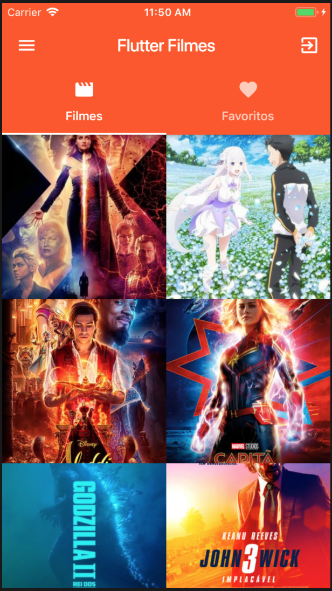
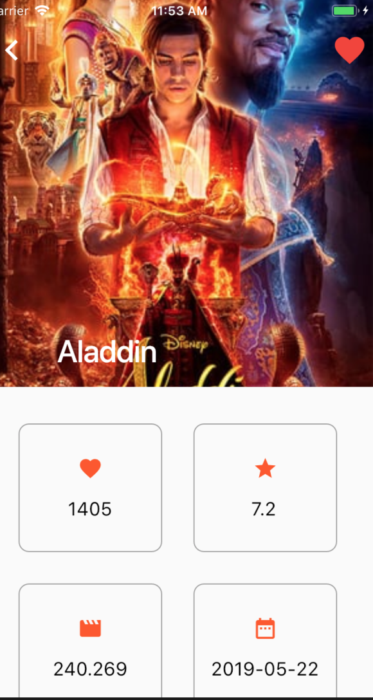

# movies_flutter_2019
App simples de lista de filmes feita com Flutter (aula 1 e aula 2).

## Projeto utiliza:

* Flutter
* FLare: https://www.2dimensions.com/a/funwithflutter/files/flare/heart/preview

* Para o Flare funcionar utilizar o channel "dev" do flutter. Abrir o terminal e digitar:
* flutter channel dev

## prints

